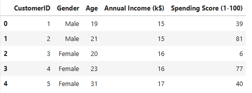
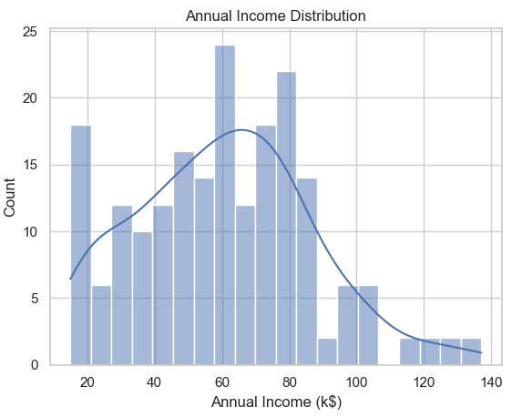
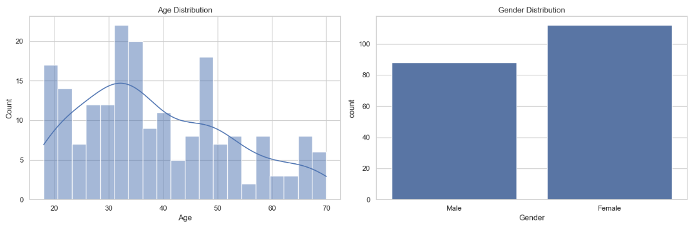
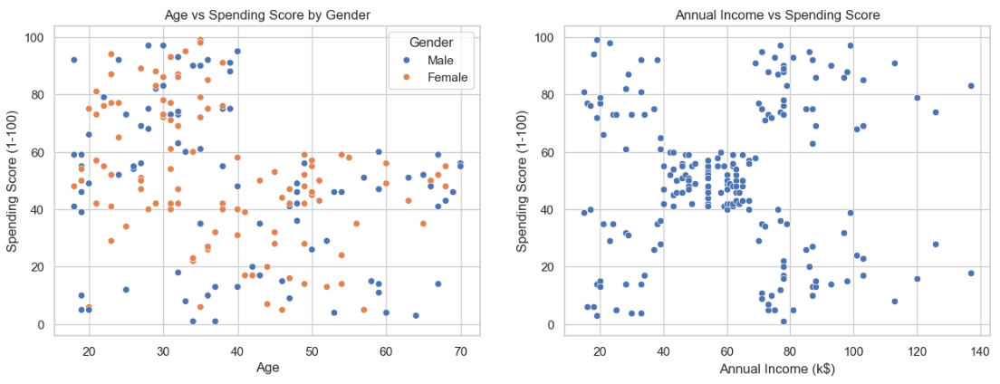
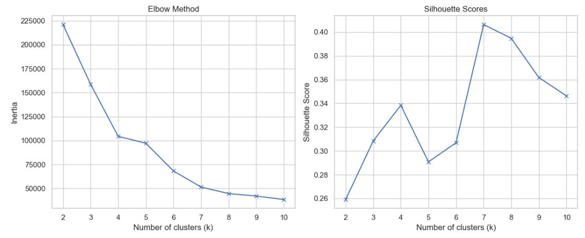
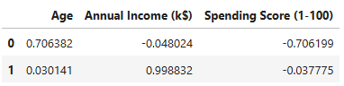
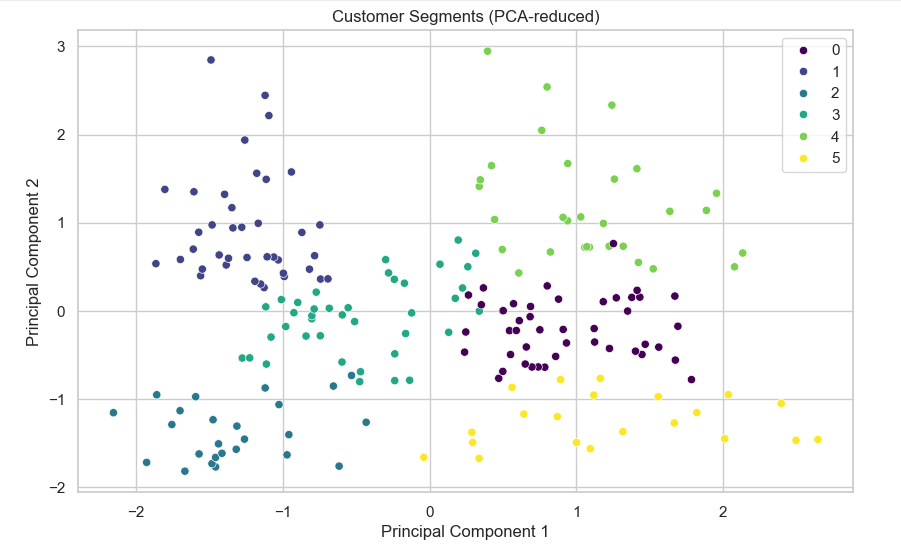

# Rappor du travail pratique du k mean.

### 1. Chargement et exploration des données

#### Comment charger et afficher les premières lignes du jeu de données ?

- on vas charger les donnees avec la fonction `read_csv()`
- on vas stocker le resultat qui est un dataframe dans un variable `df`
- on vas utiliser la method `df.head()` pour afficher les 5 premier lignes

```
df = pd.read_csv('Mall_customers.csv')
df.head()
```

et on obtenir le resultat



- apres on va obtenir les variable avec la method `df.nfo()` qui va retourner les types de variables et leur types.

```python
<class 'pandas.core.frame.DataFrame'>
RangeIndex: 200 entries, 0 to 199
Data columns (total 5 columns):
 #   Column                  Non-Null Count  Dtype
---  ------                  --------------  -----
 0   CustomerID              200 non-null    int64
 1   Gender                  200 non-null    object
 2   Age                     200 non-null    int64
 3   Annual Income (k$)      200 non-null    int64
 4   Spending Score (1-100)  200 non-null    int64
dtypes: int64(4), object(1)
memory usage: 7.9+ KB
```

- on peut reduire le nombre des variable manquants d'apres ce tableau. on 200 dans tous les variable donc on n'a pas des variables manquants.

### 2. Analyse exploratoire

- pour voir la distribution du `annual income` on va utiliser le graphe histogramme de la bibliotheque seaborn

```python
plt.subplot()
sns.histplot(df['Annual Income (k$)'], bins=20, kde=True)
plt.title('Annual Income Distribution')
```

- et on aura la distribution suivant



- on va voir la distributions des variable age et gendre.


- on peut conclure que les femme est un peu consommateur que les hommes.
- on peut conclir aussi que la consommation est plus eleve pour les personnes au moyen age, et diminue avec l'augmentation de lage.

- voici la distribution scatter



### 3. Préparation des données

- D'apres les distribution on peut dire que les plus pertinent variables sont: `l'age` et `le revenu annuel`.
- Il faut normaliser les données avant K-means car l’algorithme est basé sur les distances, et des variables d’échelles différentes biaiseraient les clusters.
- Sans normalisation, une variable (ex : salaire = 10 000€) dominerait une autre (ex : âge = 30 ans), rendant les clusters ininterprétables.
- Pour appliquer la normilisation en utilise la bibliotheque sickit learn.

```python
from sklearn.preprocessing import Normalizer
scaler = Normalizer().fit(df)
normalizedData = scaler.transform(df)
```

### 4. Clustering avec K-means

- la method de code est le suivant:
- on va importer `kmeans` class a partir la bibliotheque `sickit learn`.

```python
from sklearn.cluster import KMeans
```

- voici le code qu'on va faire pour appliquer notre algorithm

```python
inertia = []
silhouette_scores = []
k_values = range(2, 11)

for k in k_values:
    kmeans = KMeans(n_clusters=k, random_state=42)
    kmeans.fit(X)
    inertia.append(kmeans.inertia_)
    silhouette_scores.append(silhouette_score(X_scaled, kmeans.labels_))
```

- on va appliquer l'algorithme avec plusieur nombre du `k` et on va ajouter des valeura a deux tableaus de metric pour chaque valeur de cas pour enfin choisir le meilleur valeur pour `k`.


- l'orsqu'on print les valeurs des deux tableaux qui represente deux method different pour choisir le meilleur `k`. on peut voir d'appres les deux graphes que la valeur 7 est la meilleur.

### 5. Application et visualisation

- Pour la methode d'elbow on va chercher pour L'angle le plus obtus.
- on peut visualiser le cluster avec la comparisons chaque variable avec tous les autres, ici on aura beaucoup des graphes surtout si on a beaucoup des variables.
- mais on peut utiliser une autre method pour la visualisation qui s'appele `PCA` qui va reduire les dimmention avec la préservation d'information.
- on peut donner un signification au cluster trouve avec l'utilisation de `loading` de pca qui nous donne l'impact de chaque variable sur chaque component avec le code

```
loadings = pca.components_
loadings
### result
array([[ 0.70638235, -0.04802398, -0.70619946],
       [ 0.03014116,  0.9988316 , -0.03777499]])
```

- avec un peut d'éstitque on peut le transformer a une dataframe

```
loadings_df = pd.DataFrame(loadings,columns=['Age', 'Annual Income (k$)', 'Spending Score (1-100)'])
loadings
```



- ce resultat nous dis que le composant 1 est influencé par l'age et negativement par le spending score et le deuxieme composant est influencé completement par le revenu anuuel.

### 6. Analyse des résultats

- voici le resultat de clustering qu'on a obtenu d'apres le pca.


- d'apres le resultat de `loadings` on peut conclure les seguement suivants:

  - 0 : middle income - high age high spending
  - 1 : high income - low spending low age
  - 2 : high age - low spending - low income
  - 3 : middle spending and age - middle income
  - 4 : high income low age - high spending
  - 5 : middle income - high spending - low age

- on peut cibler les clients qui ont le revenu annual eleve mais le score de depense petit. en offrant des solds.
- on peut fideliser les clients qui ont un montant annuel moyen est un score de depense eleve.


