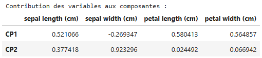

### 1) Quelle part de la variance totale est expliquée par les deux premières composantes principales ?
La variance totale expliquée par les deux premières composantes principales est de 95.8% (somme des valeurs pca.explained_variance_ratio_). Cela signifie que ces deux composantes captent la quasi-totalité de l'information des données originales.

### 2) Que remarquez-vous à propos de la séparation des classes dans le plan PCA ?
La classe "setosa" (points bleus) est très bien séparée des deux autres classes le long de la première composante principale (CP1).

Les classes "versicolor" (points orange) et "virginica" (points verts) se chevauchent partiellement, mais restent partiellement distinctes, surtout le long de la deuxième composante principale (CP2).

Cela suggère que les caractéristiques de la fleur "setosa" sont très différentes des deux autres, tandis que "versicolor" et "virginica" partagent des similarités.

### 3) Que se passerait-il si vous choisissiez n_components=3 ? Pourquoi ce choix peut être pertinent ?
Avec n_components=3, on ajouterait une troisième composante principale, ce qui permettrait de capter un peu plus de variance (généralement > 99% pour l'iris dataset).
Ce choix serait pertinent si :
On voulait visualiser les données en 3D pour mieux séparer les classes (par exemple, si "versicolor" et "virginica" étaient mieux distinguables sur la 3ème composante).
On avait besoin de plus d'information pour un modèle de machine learning (bien que pour l'iris dataset, 2 composantes suffisent).

### 4) En vous aidant des vecteurs propres (pca.components_), pouvez-vous interpréter l’influence de chaque variable sur les composantes principales ?
Interprétation des vecteurs propres (pca.components_) :
Les vecteurs propres (stockés dans pca.components_) indiquent l'influence des variables originales sur chaque composante principale. Par exemple :

CP1 (première ligne de pca.components_) :

Si une variable a un poids (valeur absolue) élevé, elle influence fortement cette composante.

Par exemple, si sepal length et petal length ont des poids élevés et de même signe, cela signifie qu'elles contribuent de manière similaire à la CP1.

CP2 (deuxième ligne) :

Les variables avec des poids opposés (ex : sepal width positif et petal length négatif) ont des effets inverses sur cette composante.

### Bonus
avec le code suivant on peut voir les effets d'une maniere plus efficace en utilisant la structure `DataFrame` de la bibliotheque pandas.
```
df_components = pd.DataFrame(
    pca.components_,
    columns=feature_names,
    index=["CP1", "CP2"]
)
print("Contribution des variables aux composantes :")
df_components
```
- à la fin voici la dataframe retourné.

