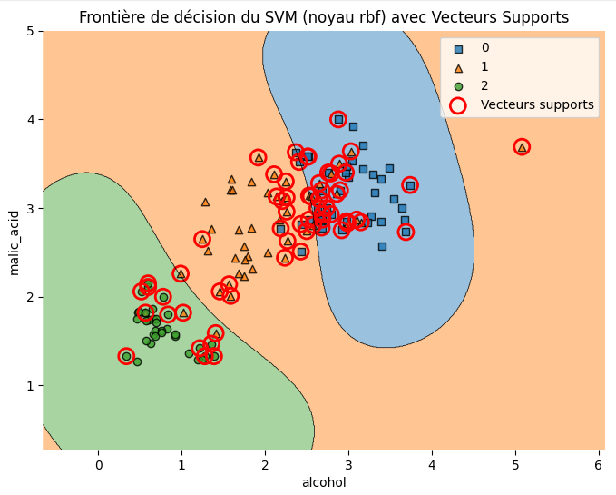
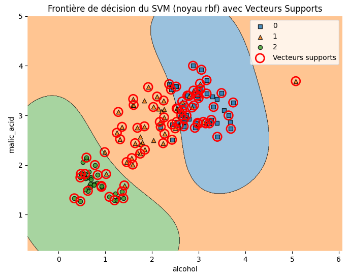
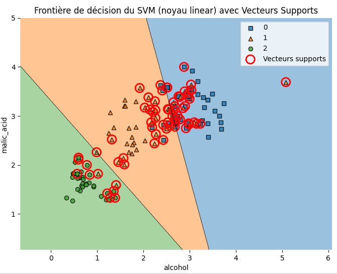
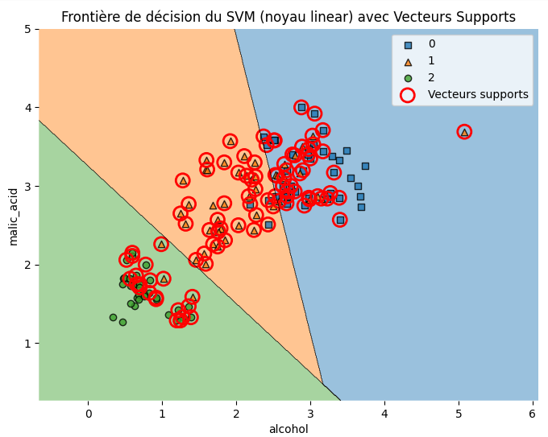

## Overview
- in this lab we will train a `SVM` model on a wine dataset from sickit learn. The model is model will classify the type of the wine from the features of it.
- we will need to compare how `SVM` functions with different `kernel functions` and with `GridSearchCV` for finding the hyperparameters. 
## Data preprocessing
- we first will import the libraries and the dataset, we will use `wine` dataset from `scikitlearn` library.
```python
import numpy as np
import pandas as pd

from sklearn.preprocessing import StandardScaler
from sklearn.datasets import load_wine
from sklearn.model_selection import train_test_split, GridSearchCV
from sklearn.svm import SVC
from sklearn.metrics import classification_report, accuracy_score

import matplotlib.pyplot as plt
import seaborn as sns
from mlxtend.plotting import plot_decision_regions
```
- then we will load the dataset with pandas
```python
wine = load_wine()
X = pd.DataFrame(wine.data, columns=wine.feature_names)
y = pd.Series(wine.target)
```
- in this lab we want to visualize and compare different approach as we mentioned, that's why we will use only two features. so we will reduce dimentions to two dimentions.
- The two features with the highest absolute correlation to Target are the most discriminative.
```python
# Compute correlation matrix
correlation = X.corrwith(y)

# Sort features by absolute correlation
sorted_features = correlation.abs().sort_values(ascending=False)
print(sorted_features)

# Select the top 2 most correlated features
top_2_features = sorted_features.index[:2]
```
- now we will split our data to the training set and testing set
```python
X_train, X_test, y_train, y_test = train_test_split(X, y, test_size=0.3, random_state=42)
```
## Model training and comparisons
- we will train our model four times as following

| kernel function | with GridSearchCV |
| - | - |
| rbf | no |
| rbf | yes |
| linear | no |
| linear | yes |

- the results was as the following
### `rbf` kernel without `GridSearchCV`

- Accuracy: 0.8888888888888888

### `rbf` kernel with `GridSearchCV`

- Accuracy: 0.8518518518518519

### `linear` kernel without `GridSearchCV`

- Accuracy: 0.8703703703703703

### `linear` kernel with `GridSearchCV`

- Accuracy: 0.8703703703703703

### notes
- the `GridSearchCv` mostly enhance the model performance but in our case it when we used `rbf` kernel it decrease the accuracy from 0.88 to 0.85 and when we used the `linear` kernel it didn't change anything about the performance.
- we used cross validation to ensure data shuffling and avoid overfitting.